# 🛠 Manual de Instalación y Configuración de Visual Studio Community 2022 con el Paquete "Desarrollo de escritorio .NET"

---

## 📌 Requisitos Previos

* Sistema operativo: Windows 10 o superior (64 bits recomendado).
* Conexión a Internet estable.
* Al menos 10 GB de espacio libre en disco.
* Cuenta de Microsoft (para activar la licencia Community).

---

## 1. Descargar el instalador de Visual Studio

1. Ve a la página oficial de descargas de Visual Studio:
   👉 [Click aquí](https://visualstudio.microsoft.com/es/downloads/)

2. Haz clic en el botón **"Descargar Visual Studio Community 2022"**.

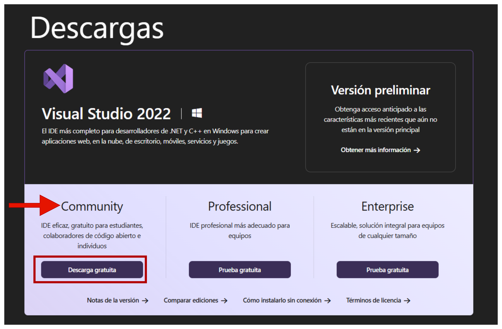

---

## 2. Ejecutar el Instalador

1. Ejecuta el archivo descargado llamado `VisualStudioSetup.exe`.
2. Se abrirá el instalador de Visual Studio. Espera a que descargue los componentes iniciales.

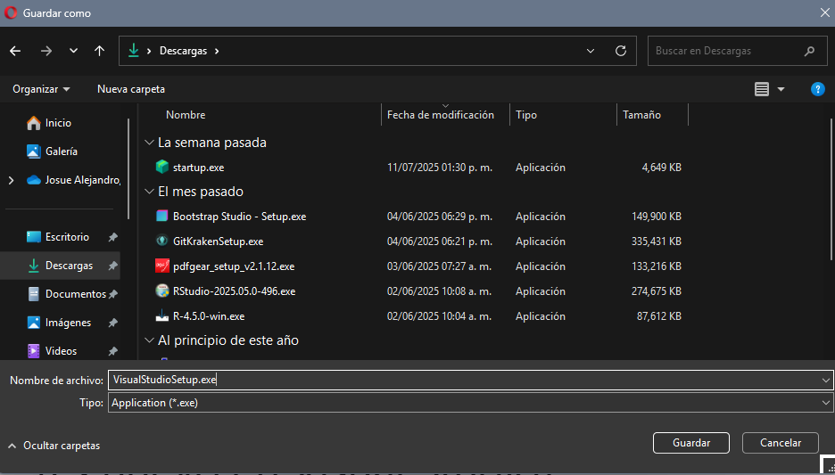

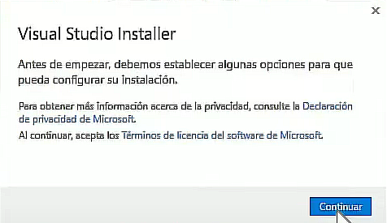

---

## 3. Seleccionar cargas de trabajo (workloads)

1. En la ventana de selección de cargas de trabajo, busca y **marca la casilla**:

   * ✅ **"Desarrollo de escritorio con .NET"**

2. Opcionalmente, puedes agregar herramientas adicionales como:

   * `.NET 6.0 o .NET 8.0 (LTS)`
   * Herramientas de depuración
   * SDK adicionales si deseas soporte para versiones anteriores de .NET

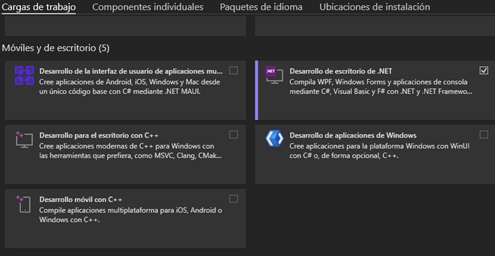

---

## 4. Ruta de instalación

1. Puedes dejar la ruta por defecto o cambiarla si lo prefieres.
2. Haz clic en **"Instalar"** para comenzar la instalación.

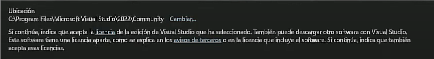

---

## 5. Esperar la instalación

* Este proceso puede tardar varios minutos dependiendo de tu velocidad de internet y equipo.

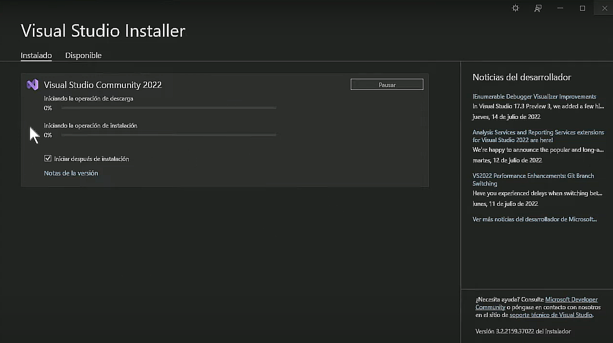

---

## 6. Iniciar Visual Studio

1. Una vez instalada, haz clic en **"Iniciar"**.
2. Inicia sesión con tu cuenta de Microsoft para activar la edición Community.
3. Selecciona un tema de color si es tu primera vez (Claro, Oscuro, Azul, etc.).

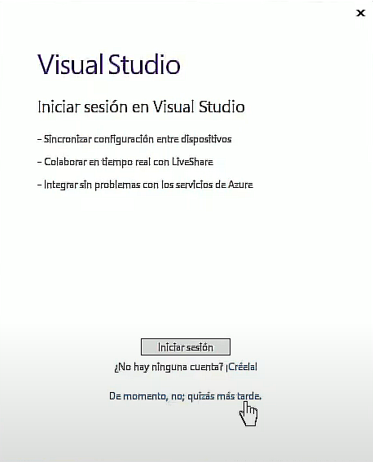

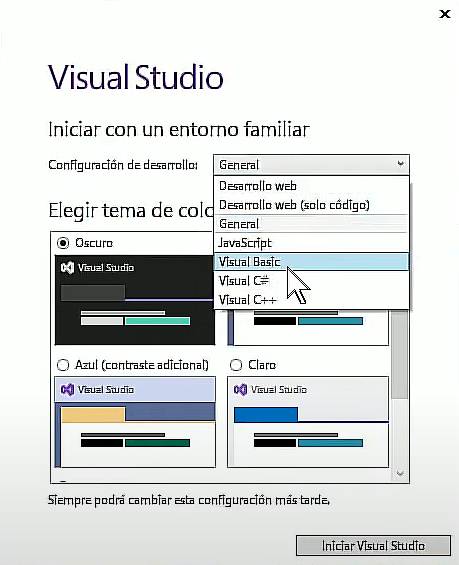

---

## 7. Crear un nuevo proyecto .NET

1. En la pantalla inicial, selecciona **"Crear un nuevo proyecto"**.

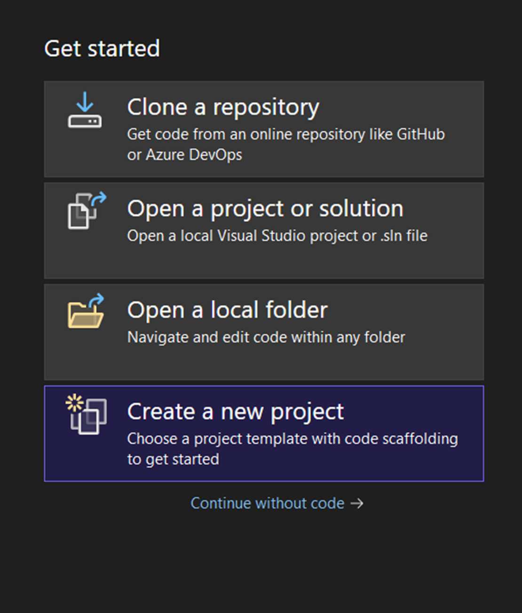

2. Elige la plantilla **"Aplicación de Windows Forms (.NET)"** o **"Aplicación WPF (.NET)"**.

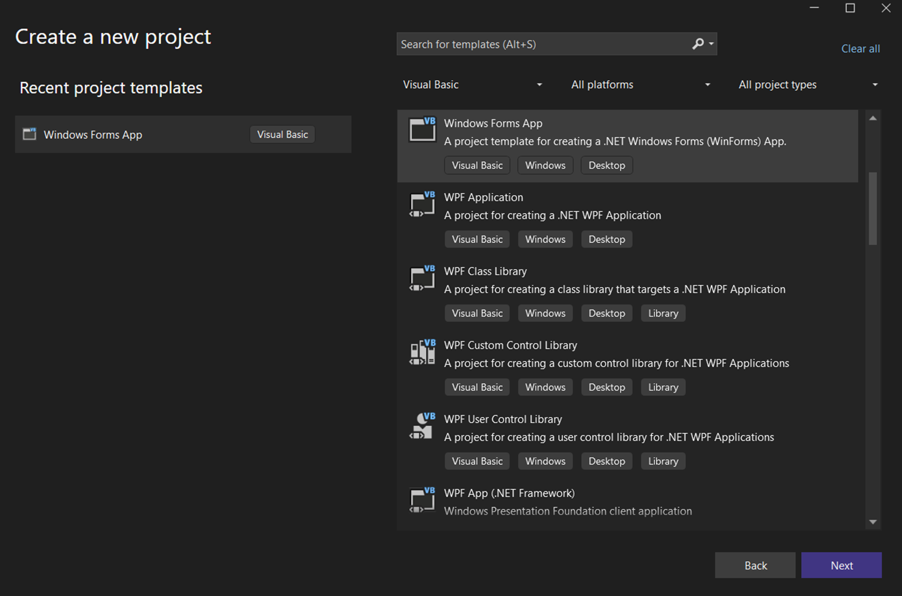

3. Configura el nombre y ubicación del proyecto.

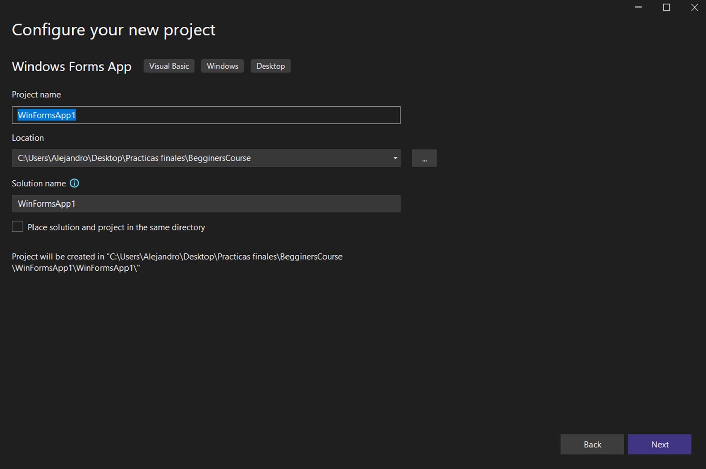

4. Haz clic en **"Crear"** para crear el proyecto.

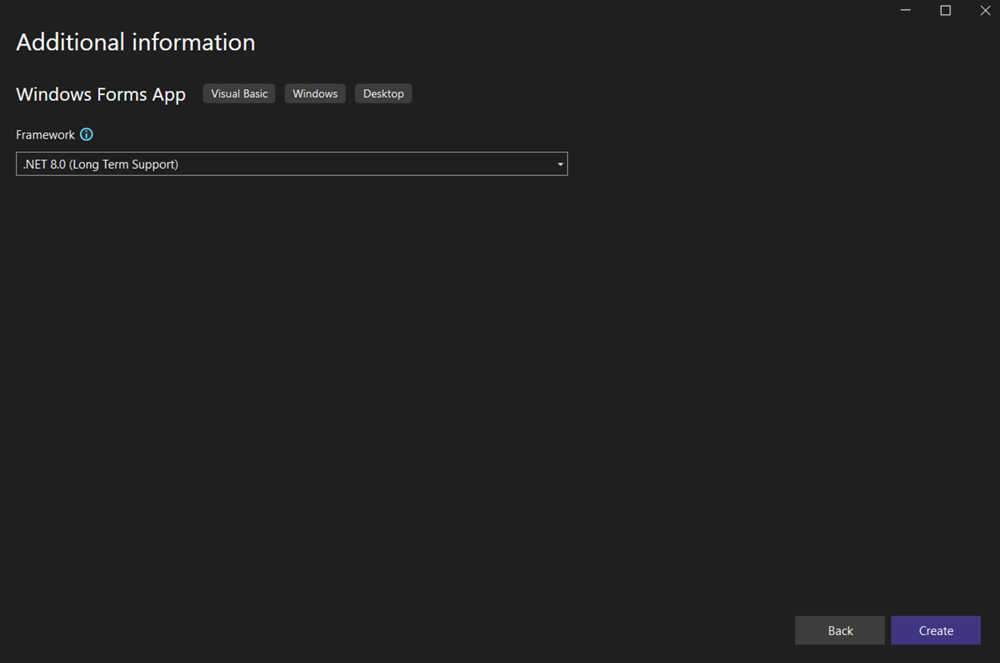

---

## ✅ ¡Listo!

Has instalado y configurado Visual Studio Community 2022 con el paquete **Desarrollo de escritorio con .NET**. Ya puedes comenzar a desarrollar aplicaciones Windows Forms.

