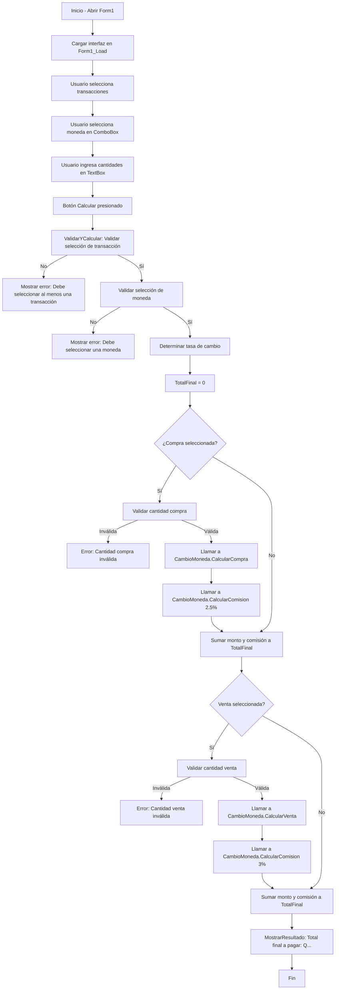

# Solución Tarea 3

## **1. Relación con los objetivos de la Tarea 3**

La Tarea 3 pide:

* **Compra y venta de divisas** con selección de moneda.
* **Ingreso de cantidades** y validaciones.
* **Cálculo de comisiones** (2.5% en compra, 3% en venta).
* **Total final a pagar** incluyendo comisión.
* **Uso de módulo** para separar la lógica de cálculo.
* **Botones Calcular, Limpiar y Salir** con sus funciones.
* **Validaciones y mensajes de error** si faltan datos u opciones.
* **Diseño amigable**.
* **If’s independientes o anidados donde sea necesario**.

---

## **2. Explicación de `Form1.vb`**

### Código
```vb
Public Class Form1

    ' Declaración de controles
    Private lblInstrucciones As Label
    Private chkCompra As CheckBox
    Private chkVenta As CheckBox
    Private lblMoneda As Label
    Private cmbMoneda As ComboBox
    Private lblCantidadCompra As Label
    Private txtCantidadCompra As TextBox
    Private lblCantidadVenta As Label
    Private txtCantidadVenta As TextBox
    Private btnCalcular As Button
    Private btnLimpiar As Button
    Private btnSalir As Button
    Private lblResultado As Label

    Private Sub Form1_Load(sender As Object, e As EventArgs) Handles MyBase.Load
        ' Configura el tamaño del formulario para un diseño más amplio
        Size = New Size(800, 600)
        Text = "Casa de Cambios"

        ' Crea y posiciona la etiqueta de instrucciones con más espacio
        lblInstrucciones = New Label()
        lblInstrucciones.Location = New Point(20, 20)
        lblInstrucciones.Text = "Seleccione transacción(es) y moneda. Ingrese cantidades según corresponda."
        lblInstrucciones.AutoSize = True
        Controls.Add(lblInstrucciones)

        ' Crea checkbox para Compra
        chkCompra = New CheckBox()
        chkCompra.Location = New Point(20, 70)
        chkCompra.Text = "Compra (Quetzales a Moneda Extranjera)"
        chkCompra.AutoSize = True
        Controls.Add(chkCompra)

        ' Crea checkbox para Venta
        chkVenta = New CheckBox()
        chkVenta.Location = New Point(20, 110)
        chkVenta.Text = "Venta (Moneda Extranjera a Quetzales)"
        chkVenta.AutoSize = True
        Controls.Add(chkVenta)

        ' Crea etiqueta para selección de moneda
        lblMoneda = New Label()
        lblMoneda.Location = New Point(20, 160)
        lblMoneda.Text = "Seleccione Moneda:"
        lblMoneda.AutoSize = True
        Controls.Add(lblMoneda)

        ' Crea ComboBox para monedas
        cmbMoneda = New ComboBox()
        cmbMoneda.Location = New Point(200, 160)
        cmbMoneda.Width = 250
        cmbMoneda.Items.AddRange(New String() {"Dólar (Q7.69 por USD)", "Peso Mexicano (Q0.38 por MXN)", "Euro (Q8.79 por EUR)", "Colón Costarricense (Q0.012 por CRC)"})
        Controls.Add(cmbMoneda)

        ' Crea etiqueta y textbox para cantidad en compra
        lblCantidadCompra = New Label()
        lblCantidadCompra.Location = New Point(50, 210)
        lblCantidadCompra.Text = "Cantidad Quetzales para Compra:"
        lblCantidadCompra.AutoSize = True
        Controls.Add(lblCantidadCompra)

        txtCantidadCompra = New TextBox()
        txtCantidadCompra.Location = New Point(400, 210)
        txtCantidadCompra.Width = 250
        Controls.Add(txtCantidadCompra)

        ' Crea etiqueta y textbox para cantidad en venta
        lblCantidadVenta = New Label()
        lblCantidadVenta.Location = New Point(50, 260)
        lblCantidadVenta.Text = "Cantidad Moneda Extranjera para Venta:"
        lblCantidadVenta.AutoSize = True
        Controls.Add(lblCantidadVenta)

        txtCantidadVenta = New TextBox()
        txtCantidadVenta.Location = New Point(400, 260)
        txtCantidadVenta.Width = 250
        Controls.Add(txtCantidadVenta)

        ' Crea botón Calcular
        btnCalcular = New Button()
        btnCalcular.Location = New Point(20, 310)
        btnCalcular.Text = "Calcular Total"
        btnCalcular.Size = New Size(120, 30)
        AddHandler btnCalcular.Click, AddressOf btnCalcular_Click
        Controls.Add(btnCalcular)

        ' Crea botón Limpiar
        btnLimpiar = New Button()
        btnLimpiar.Location = New Point(160, 310)
        btnLimpiar.Text = "Limpiar"
        btnLimpiar.Size = New Size(120, 30)
        AddHandler btnLimpiar.Click, AddressOf btnLimpiar_Click
        Controls.Add(btnLimpiar)

        ' Crea botón Salir
        btnSalir = New Button()
        btnSalir.Location = New Point(300, 310)
        btnSalir.Text = "Salir"
        btnSalir.Size = New Size(120, 30)
        AddHandler btnSalir.Click, AddressOf btnSalir_Click
        Controls.Add(btnSalir)

        ' Crea etiqueta para resultado
        lblResultado = New Label()
        lblResultado.Location = New Point(20, 360)
        lblResultado.Text = "Resultado: "
        lblResultado.AutoSize = True
        lblResultado.Width = 450
        Controls.Add(lblResultado)
    End Sub

    Private Sub btnCalcular_Click(sender As Object, e As EventArgs)
        ' Llama al procedimiento de validación y cálculo
        ValidarYCalcular()
    End Sub

    Private Sub btnLimpiar_Click(sender As Object, e As EventArgs)
        ' Llama al procedimiento para limpiar controles
        LimpiarControles()
    End Sub

    Private Sub btnSalir_Click(sender As Object, e As EventArgs)
        ' Pregunta al usuario si desea salir
        If MessageBox.Show("¿Desea salir de la aplicación?", "Confirmar Salida", MessageBoxButtons.YesNo) = DialogResult.Yes Then
            Close()
        End If
    End Sub

    Private Sub ValidarYCalcular()
        ' Inicia bloque de manejo de errores
        Try
            ' Verifica si se seleccionó al menos una transacción
            If Not chkCompra.Checked And Not chkVenta.Checked Then
                MessageBox.Show("Debe seleccionar al menos una transacción: Compra o Venta.")
                Return
            End If

            ' Verifica selección de moneda
            If cmbMoneda.SelectedIndex = -1 Then
                MessageBox.Show("Debe seleccionar una moneda.")
                Return
            End If

            ' Obtiene tasa de cambio según moneda seleccionada
            Dim tasa As Decimal
            Dim moneda As String = cmbMoneda.SelectedItem.ToString()
            If moneda.Contains("Dólar") Then
                tasa = 7.69D
            ElseIf moneda.Contains("Peso") Then
                tasa = 0.38D
            ElseIf moneda.Contains("Euro") Then
                tasa = 8.79D
            ElseIf moneda.Contains("Colón") Then
                tasa = 0.012D
            End If

            Dim totalFinal As Decimal = 0D

            ' Procesa compra si está seleccionada
            If chkCompra.Checked Then
                Dim quetzalesCompra As Decimal
                If Not Decimal.TryParse(txtCantidadCompra.Text, quetzalesCompra) OrElse quetzalesCompra <= 0 Then
                    MessageBox.Show("La cantidad para compra debe ser un número positivo.")
                    Return
                End If
                Dim montoCompra As Decimal = CambioMoneda.CalcularCompra(quetzalesCompra, tasa)
                Dim comisionCompra As Decimal = CambioMoneda.CalcularComision(montoCompra, 0.025D)
                totalFinal += montoCompra + comisionCompra
            End If

            ' Procesa venta si está seleccionada
            If chkVenta.Checked Then
                Dim monedaVenta As Decimal
                If Not Decimal.TryParse(txtCantidadVenta.Text, monedaVenta) OrElse monedaVenta <= 0 Then
                    MessageBox.Show("La cantidad para venta debe ser un número positivo.")
                    Return
                End If
                Dim montoVenta As Decimal = CambioMoneda.CalcularVenta(monedaVenta, tasa)
                Dim comisionVenta As Decimal = CambioMoneda.CalcularComision(montoVenta, 0.03D)
                totalFinal += montoVenta + comisionVenta
            End If

            ' Muestra el resultado
            MostrarResultado(totalFinal)
        Catch ex As Exception
            MessageBox.Show("Error inesperado: " & ex.Message)
        End Try
    End Sub

    Private Sub MostrarResultado(total As Decimal)
        ' Procedimiento para mostrar el resultado en la etiqueta
        lblResultado.Text = "Total final a pagar (incluyendo comisión): Q" & total.ToString("N2")
    End Sub

    Private Sub LimpiarControles()
        ' Procedimiento para limpiar todos los controles
        chkCompra.Checked = False
        chkVenta.Checked = False
        cmbMoneda.SelectedIndex = -1
        txtCantidadCompra.Text = ""
        txtCantidadVenta.Text = ""
        lblResultado.Text = "Resultado: "
    End Sub

End Class
```

### **Diseño y controles**

En el evento `Form1_Load`:

* Se **crean y configuran todos los controles** (etiquetas, checkboxes, combobox, textbox y botones).
* El **ComboBox** (`cmbMoneda`) contiene las monedas con su tasa de cambio textual.
* Botones `Calcular`, `Limpiar`, `Salir` con sus eventos asociados.

---

### **Eventos principales**

1. **`btnCalcular_Click` → `ValidarYCalcular`**

   * **Validaciones iniciales:**

     * Verifica que haya **al menos una transacción seleccionada** (`chkCompra` o `chkVenta`).
     * Verifica que haya **moneda seleccionada** (`cmbMoneda`).
   * **Obtención de la tasa** según la moneda elegida (estructura `If...ElseIf`).
   * **Procesamiento de compra** si `chkCompra.Checked`:

     * Validar que `txtCantidadCompra` tenga un **número positivo** (`Decimal.TryParse`).
     * Llamar a `CambioMoneda.CalcularCompra` para convertir quetzales a moneda extranjera.
     * Calcular comisión (2.5%) con `CambioMoneda.CalcularComision`.
     * Sumar al total.
   * **Procesamiento de venta** si `chkVenta.Checked`:

     * Validar que `txtCantidadVenta` tenga un **número positivo**.
     * Llamar a `CambioMoneda.CalcularVenta` para convertir moneda extranjera a quetzales.
     * Calcular comisión (3%) y sumar al total.
   * Mostrar el total con `MostrarResultado`.

2. **`btnLimpiar_Click` → `LimpiarControles`**

   * Limpia todos los campos, desmarca opciones y reinicia `lblResultado`.

3. **`btnSalir_Click`**

   * Confirma con el usuario si desea salir (`MessageBox.Show` con Yes/No).

---

### **Partes clave que cumplen la tarea**

* **If’s independientes y anidados:**

  * Independientes para validar selección de transacción y moneda.
  * Anidados para decidir tasa según moneda seleccionada.
* **Validaciones de datos** con `TryParse` y mensajes de error.
* **Uso de procedimientos** (`ValidarYCalcular`, `MostrarResultado`, `LimpiarControles`) para organizar el código.
* **Diseño amigable:** controles claros y etiquetas descriptivas.

---

## **3. Explicación de `CambioMoneda.vb`**

### Código
```vb
' CambioMoneda.vb (Módulo utilizado para cálculos)
Module CambioMoneda

    Public Function CalcularCompra(quetzales As Decimal, tasa As Decimal) As Decimal
        ' Calcula la cantidad de moneda extranjera obtenida por quetzales (Compra: Quetzales a Extranjera)
        Return quetzales / tasa
    End Function

    Public Function CalcularVenta(monedaExtranjera As Decimal, tasa As Decimal) As Decimal
        ' Calcula la cantidad de quetzales obtenidos por moneda extranjera (Venta: Extranjera a Quetzales)
        Return monedaExtranjera * tasa
    End Function

    Public Function CalcularComision(monto As Decimal, porcentaje As Decimal) As Decimal
        ' Calcula la comisión sobre el monto
        Return monto * porcentaje
    End Function

End Module
```

Es un **módulo** con funciones que separan la **lógica de cálculo** del formulario:

* **`CalcularCompra(quetzales, tasa)`**
  Convierte quetzales a moneda extranjera (`quetzales / tasa`).

* **`CalcularVenta(monedaExtranjera, tasa)`**
  Convierte moneda extranjera a quetzales (`monedaExtranjera * tasa`).

* **`CalcularComision(monto, porcentaje)`**
  Calcula la comisión multiplicando el monto por el porcentaje.

---

### **Claves en el módulo**

* Centraliza la lógica matemática → el formulario solo llama a estas funciones.
* Mejora la **reutilización** y **mantenibilidad**.
* Facilita cambios futuros (por ejemplo, si cambian las tasas o comisiones).

---

## **4. Flujo del programa**

1. **Carga de formulario** (`Form1_Load`):

   * Se construye la interfaz (labels, checkboxes, combobox, textboxes, botones).

2. **Usuario selecciona transacciones y moneda**:

   * Puede marcar compra, venta o ambas.
   * Elige moneda en `cmbMoneda`.

3. **Usuario ingresa cantidades**:

   * `txtCantidadCompra` para quetzales (si compra).
   * `txtCantidadVenta` para moneda extranjera (si venta).

4. **Clic en "Calcular"**:

   * `ValidarYCalcular`:

     * Verifica datos y opciones.
     * Determina tasa de cambio.
     * Llama a funciones del módulo para:

       * Calcular monto.
       * Calcular comisión.
     * Suma totales.
   * `MostrarResultado` muestra total final.

5. **Opciones adicionales**:

   * "Limpiar" → borra entradas y resultados.
   * "Salir" → pide confirmación y cierra.

---


